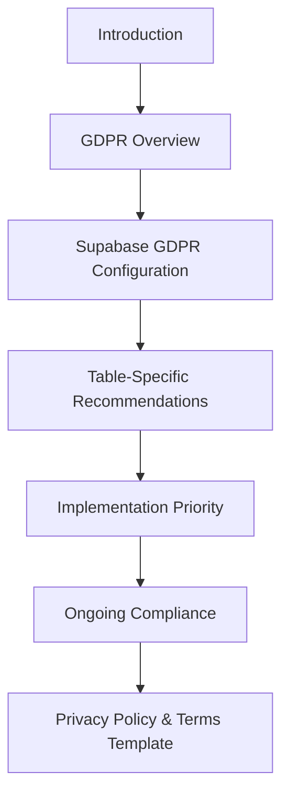
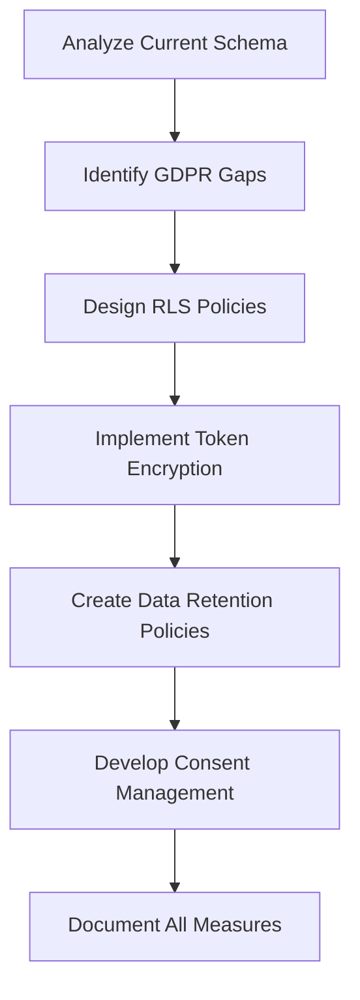

# GDPR Compliance Plan for Supabase Implementation

## Document Structure

## Section Details

### Introduction
- Brief overview of the document purpose
- Context about the PhD project on high exercise research
- Importance of GDPR compliance for research data

### GDPR Overview
- Key GDPR principles relevant to research applications
- Special considerations for health/fitness data
- Lawful basis for processing in research contexts
- Data subject rights in research settings

### Supabase GDPR Configuration Checklist
- **Database-level settings**:
  - Enabling Row Level Security (RLS) across all tables
  - Setting up proper authentication flows
  - Configuring secure API access
  
- **Data encryption strategies**:
  - Implementing pgcrypto for OAuth token encryption
  - Column-level encryption for sensitive fields
  - Key management recommendations
  
- **User consent management**:
  - Consent collection workflow
  - Storing consent records
  - Consent withdrawal mechanisms
  
- **Data retention policies**:
  - Research data retention timeframes
  - Automated data purging mechanisms
  - Data anonymization strategies
  
- **Data subject rights implementation**:
  - Access request handling
  - Data portability implementation
  - Right to erasure mechanisms
  - Data rectification processes

### Table-Specific Recommendations
For each table category:
- **User/Profile Tables**:
  - Personal data fields identification
  - RLS policies
  - Encryption needs
  - Data minimization strategies
  
- **Strava Athlete Tables**:
  - OAuth token encryption
  - Personal data protection
  - RLS policies
  
- **Activity Data Tables**:
  - Location data handling
  - Biometric data protection
  - RLS policies
  
- **Heart Rate/Biometric Tables**:
  - Special category data protection
  - Anonymization options
  - RLS policies

### Implementation Priority
- Critical security issues (OAuth tokens, RLS)
- High-priority data protection measures
- Medium-priority compliance features
- Long-term compliance roadmap

### Ongoing Compliance Monitoring
- Regular audit procedures
- Compliance testing methodologies
- Documentation requirements
- Incident response planning

### Privacy Policy & Terms Template
- Research-specific privacy policy sections
- Data processing disclosures
- User rights explanations
- Consent management details

## Implementation Approach

## Key Technical Solutions to Include

1. **OAuth Token Encryption**:
   - Using pgcrypto extension in Supabase
   - Implementing server-side encryption/decryption functions
   - Key rotation strategies

2. **Row Level Security Implementation**:
   - User-based policies for all tables
   - Role-based access control system with three tiers:
     - `user`: Regular users who can only access their own data
     - `researcher`: Research staff who can view all data for research purposes
     - `admin`: Administrators with full access to view and modify all data
   - Public/private data separation

3. **Data Minimization**:
   - Pseudonymization techniques
   - Data aggregation strategies
   - Minimal collection principles

4. **Consent Management**:
   - Granular consent options
   - Consent versioning
   - Audit trail for consent changes

5. **Data Subject Rights**:
   - API endpoints for data access
   - Data export functionality
   - Account deletion workflow

## Document Deliverables

1. Main GDPR compliance document with all sections
2. SQL scripts for implementing RLS policies
3. SQL scripts for implementing token encryption
4. Privacy policy template sections
5. Terms and conditions template sections