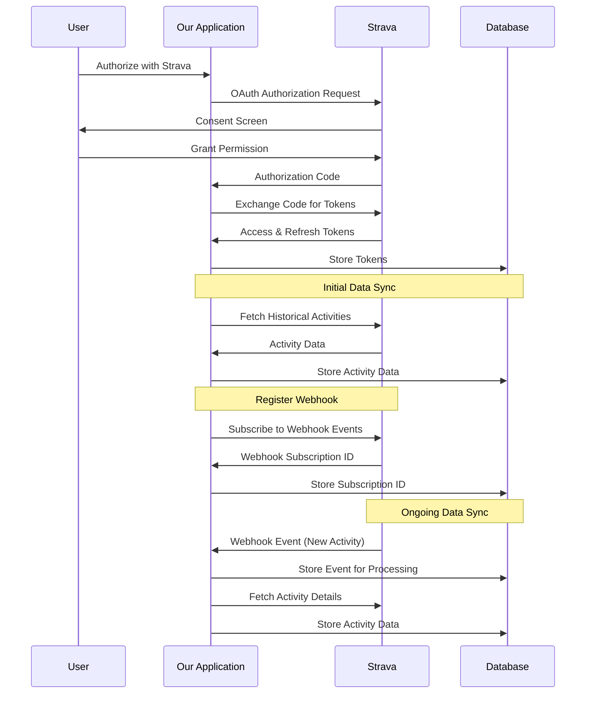

# Strava Data Synchronization Flow

This document explains when and how user activity data is pulled from Strava after a user authorizes our application.

## Data Synchronization Timeline



## Data Synchronization Process

### 1. Initial Authentication

When a user first connects their Strava account:

1. User clicks "Connect with Strava" button
2. User is redirected to Strava's authorization page
3. User grants permission to our application
4. Strava redirects back to our application with an authorization code
5. Our application exchanges the code for access and refresh tokens
6. Tokens are securely stored in the database

### 2. Initial Data Sync

Immediately after successful authentication, we perform an initial sync:

1. We fetch historical activities based on the `initialSync.daysToFetch` setting (default: 7 days)
2. For each activity, we fetch detailed data including:
   - Basic activity information (distance, time, etc.)
   - Heart rate data (if available)
   - GPS data (if available)
   - Other metrics (cadence, power, etc.)
3. Activities are processed in batches to respect Strava's rate limits
4. All data is stored in the appropriate database tables

### 3. Webhook Registration

After initial sync, we register for webhook notifications:

1. We register a webhook subscription with Strava
2. Strava sends a validation request to our webhook endpoint
3. Our endpoint validates the request and responds with the challenge
4. Strava confirms the webhook subscription
5. The subscription ID is stored for future reference

### 4. Ongoing Data Sync via Webhooks

After setup, data is synchronized in real-time via webhooks:

1. When a user creates, updates, or deletes an activity on Strava
2. Strava sends a webhook event to our application
3. Our webhook endpoint validates and stores the event
4. A background process handles the event asynchronously:
   - For new activities: Fetch and store the activity data
   - For updated activities: Update the existing data
   - For deleted activities: Remove the data from our database

### 5. Fallback Polling Mechanism

As a safety net, we also implement a polling mechanism:

1. Periodically (default: every 4 hours), we check for recent activities
2. We compare with our database to identify any missing activities
3. Any missing activities are fetched and stored
4. This ensures data consistency even if webhook events are missed

## Data Storage

Activity data is stored in several tables:

1. `strava_activities` - Basic activity information
2. `strava_activity_streams` - Time-series data for activities
3. `strava_activity_hr_stream_points` - Detailed heart rate data points

## Configuration

The synchronization process is configurable through the `stravaSync` object in `lib/config.ts`:

```typescript
export const stravaSync = {
  // Initial sync settings when user first connects
  initialSync: {
    // Number of days of historical data to fetch
    daysToFetch: 7,
    // Maximum number of activities to fetch during initial sync
    maxActivities: 200,
    // Batch size for processing activities
    batchSize: 10,
    // Delay between batches to respect rate limits (ms)
    batchDelay: 1000,
  },
  
  // Other configuration settings...
};
```

## Summary

Our Strava data synchronization follows a hybrid approach:

1. **Initial Sync**: Fetch historical data when user first connects
2. **Real-time Updates**: Use webhooks for immediate updates
3. **Fallback Polling**: Periodically check for missed activities

This approach ensures that we have complete and up-to-date activity data while respecting Strava's API rate limits and minimizing API calls.