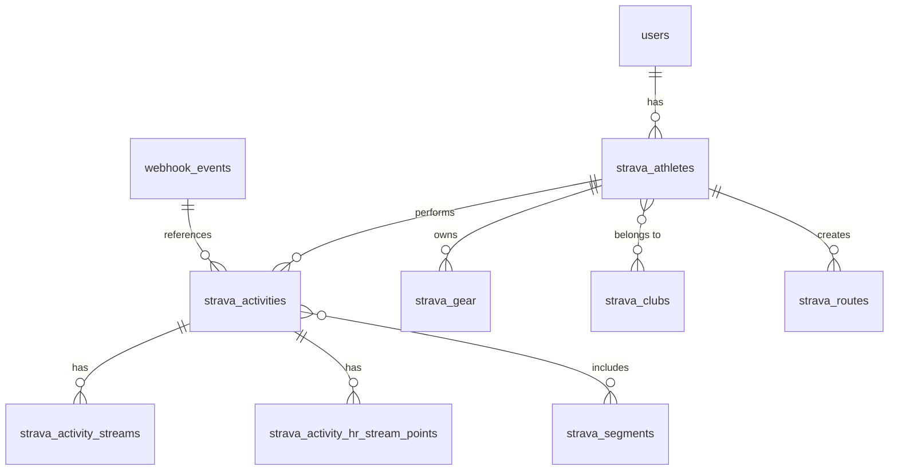

# Strava SQL Files Index

This document provides an index of all Strava-related SQL files in the project, explaining their purpose and relationships.

## SQL Files Overview

| File | Purpose |
|------|---------|
| [strava_activities.sql](./strava_activities.sql) | Stores basic activity information from Strava |
| [strava_activity_streams.sql](./strava_streams.sql) | Stores time-series data for activities (GPS, heart rate, etc.) |
| [strava_athlete.sql](./strava_athlete.sql) | Stores athlete profile information |
| [strava_clubs.sql](./strava_clubs.sql) | Stores information about clubs the athlete belongs to |
| [strava_gear.sql](./strava_gear.sql) | Stores information about athlete's gear (bikes, shoes, etc.) |
| [strava_heart_rate.sql](./strava_heart_rate.sql) | Stores detailed heart rate data points for analysis |
| [strava_routes.sql](./strava_routes.sql) | Stores routes created by the athlete |
| [strava_segments.sql](./strava_segments.sql) | Stores segment information and efforts |
| [strava_webhook_events.sql](./strava_webhook_events.sql) | Stores webhook events for asynchronous processing |
| [users.sql](./users.sql) | Stores user information and links to Strava athletes |

## Database Schema Relationships

## Data Flow

1. User authenticates with Strava → `users` and `strava_athletes` tables updated
2. Initial sync fetches activities → `strava_activities` table populated
3. For each activity, streams are fetched → `strava_activity_streams` table populated
4. Heart rate data is extracted → `strava_activity_hr_stream_points` table populated
5. Webhook events received → `webhook_events` table updated
6. Webhook events processed → Other tables updated accordingly

## Key Tables

### webhook_events

Stores webhook events from Strava for asynchronous processing:

- `id`: UUID primary key
- `event_data`: JSONB containing the raw webhook event
- `status`: Processing status (pending, processing, completed, failed)
- `attempts`: Number of processing attempts
- `created_at`: When the event was received
- `processed_at`: When the event was processed
- `error_message`: Error message if processing failed

### strava_activities

Stores activity information:

- `strava_id`: Activity ID from Strava (primary key)
- `athlete_id`: Reference to strava_athletes
- `name`: Activity name
- `description`: Activity description
- `distance`: Distance in meters
- `moving_time`: Moving time in seconds
- `elapsed_time`: Elapsed time in seconds
- `total_elevation_gain`: Elevation gain in meters
- `activity_type`: Type of activity (ride, run, etc.)
- `start_date`: Start date and time
- `has_heartrate`: Whether heart rate data is available
- ... (and many more fields)

### strava_activity_streams

Stores time-series data for activities:

- `activity_id`: Reference to strava_activities
- `time`: Array of time points
- `distance`: Array of distance points
- `latlng`: Array of GPS coordinates
- `altitude`: Array of altitude points
- `velocity_smooth`: Array of velocity points
- `heartrate`: Array of heart rate points
- `cadence`: Array of cadence points
- `watts`: Array of power points
- ... (and other stream types)

### strava_activity_hr_stream_points

Stores individual heart rate data points for detailed analysis:

- `id`: UUID primary key
- `activity_id`: Reference to strava_activities
- `athlete_id`: Reference to strava_athletes
- `time_offset`: Time offset in seconds from activity start
- `heart_rate`: Heart rate value in BPM

## Usage

These SQL files define the database schema for storing and processing Strava data. They should be executed in the following order:

1. `users.sql`
2. `strava_athlete.sql`
3. `strava_activities.sql`
4. `strava_activity_streams.sql`
5. `strava_heart_rate.sql`
6. Other tables
7. `strava_webhook_events.sql` (requires the other tables to exist)

## Notes

- All tables have appropriate indexes for efficient querying
- Row-level security policies are applied to restrict access
- Foreign key constraints ensure data integrity
- Some tables include automatic cleanup functions to prevent excessive growth