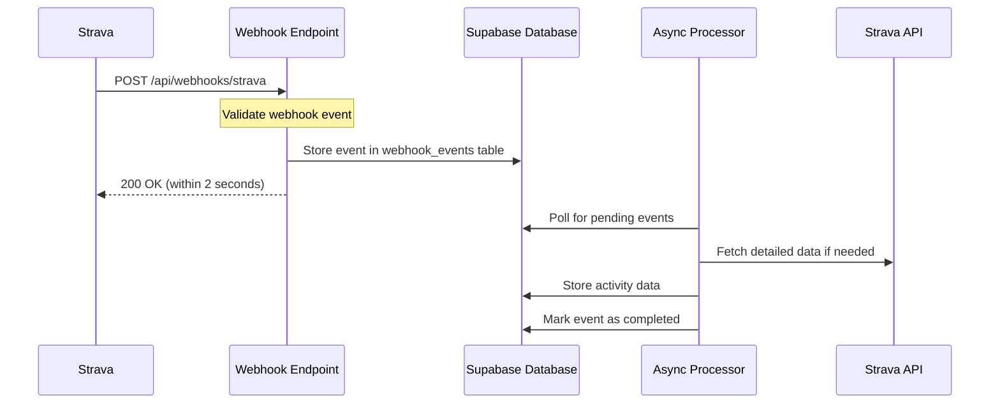

# Strava Webhook Integration

This document explains how the Strava webhook integration works in our application, including the data flow, configuration, and implementation details.

## Overview

The Strava webhook system allows our application to receive real-time notifications when a user's Strava data changes. This includes:

- New activities being created
- Activities being updated or deleted
- Athletes deauthorizing our application

When a user connects their Strava account to our application, we subscribe to webhook events for that user. Strava then sends HTTP POST requests to our webhook endpoint whenever relevant events occur.

## Architecture



## Webhook Endpoint

The webhook endpoint is implemented at `/api/webhooks/strava/route.ts` and handles two types of requests:

1. **GET requests** - Used by Strava to validate the webhook subscription
2. **POST requests** - Used by Strava to send event notifications

### Webhook Validation (GET)

When setting up a webhook subscription, Strava sends a GET request with a challenge parameter. Our endpoint must respond with this challenge to verify ownership of the URL.

```typescript
// Example validation request
// GET /api/webhooks/strava?hub.mode=subscribe&hub.challenge=123456&hub.verify_token=YOUR_VERIFY_TOKEN
```

### Webhook Events (POST)

Strava sends POST requests to our endpoint when events occur. These requests must be processed quickly (within 2 seconds) to avoid timeouts.

```json
// Example webhook event
{
  "object_type": "activity",
  "object_id": 12345678987654321,
  "aspect_type": "create",
  "owner_id": 134815,
  "subscription_id": 123456,
  "event_time": 1516126040
}
```

## Asynchronous Processing

Since Strava requires a response within 2 seconds, we use an asynchronous processing approach:

1. Webhook endpoint receives the event
2. Event is validated and stored in the `webhook_events` table
3. Endpoint responds to Strava immediately (within 2 seconds)
4. Background process handles the event asynchronously
5. If processing fails, it's retried based on configuration

## Database Schema

The webhook events are stored in the `webhook_events` table:

```sql
CREATE TABLE webhook_events (
  id UUID PRIMARY KEY DEFAULT uuid_generate_v4(),
  event_data JSONB NOT NULL,
  status VARCHAR(20) NOT NULL,
  attempts INTEGER NOT NULL DEFAULT 0,
  created_at TIMESTAMP WITH TIME ZONE NOT NULL,
  processed_at TIMESTAMP WITH TIME ZONE,
  error_message TEXT
);
```

## Configuration

The webhook system is configured in `lib/config.ts` under the `stravaSync` object:

```typescript
export const stravaSync = {
  // Initial sync settings
  initialSync: { /* ... */ },
  
  // Webhook settings
  webhook: {
    responseTimeout: 1500, // ms
    maxRetries: 3,
    retryDelay: 5000, // ms
  },
  
  // API request settings
  api: { /* ... */ },
  
  // Polling fallback
  polling: { /* ... */ },
  
  // Activity data settings
  activity: { /* ... */ },
};
```

## Environment Variables

The following environment variables are required for the webhook system:

- `STRAVA_CLIENT_ID` - Your Strava API client ID
- `STRAVA_CLIENT_SECRET` - Your Strava API client secret
- `STRAVA_VERIFY_TOKEN` - A random string used to verify webhook subscriptions
- `STRAVA_WEBHOOK_SUBSCRIPTION_ID` - The ID of your webhook subscription (obtained after registration)

## Setting Up a Webhook Subscription

To set up a webhook subscription with Strava:

1. Create a random verification token and add it to your environment variables
2. Ensure your webhook endpoint is publicly accessible
3. Register your webhook with Strava:

```bash
curl -X POST https://www.strava.com/api/v3/push_subscriptions \
  -F client_id=YOUR_CLIENT_ID \
  -F client_secret=YOUR_CLIENT_SECRET \
  -F callback_url=https://your-domain.com/api/webhooks/strava \
  -F verify_token=YOUR_VERIFY_TOKEN
```

4. Store the returned subscription ID in your environment variables

## Event Processing

When a webhook event is received, it's processed based on the event type:

### Activity Events

- **create**: Fetch and store the new activity
- **update**: Update the existing activity
- **delete**: Remove the activity from our database

### Athlete Events

- **update** with `authorized: false`: Handle deauthorization by removing tokens

## Fallback Mechanism

In case webhook events are missed, a polling mechanism can be enabled as a fallback:

```typescript
polling: {
  enabled: true,
  interval: 14_400_000, // 4 hours in ms
  activityLimit: 10,
}
```

## Error Handling

The webhook system includes robust error handling:

1. Events that fail processing are retried based on configuration
2. After maximum retries, events are marked as failed
3. Failed events are logged with error messages for debugging
4. Old events are automatically cleaned up based on their status

## Security Considerations

1. The webhook endpoint validates all incoming requests
2. The verification token ensures only Strava can trigger our webhook
3. Row-level security in Supabase restricts access to webhook data
4. All API requests use proper authentication and token refresh

## Testing the Webhook

You can test the webhook locally using tools like ngrok:

1. Run your application locally
2. Use ngrok to expose your local server: `ngrok http 3000`
3. Register a webhook with Strava using the ngrok URL
4. Trigger events by creating/updating activities on Strava

## Troubleshooting

Common issues and solutions:

1. **Webhook validation fails**: Check your verification token
2. **Events not being processed**: Check the webhook_events table for errors
3. **Missing activities**: Verify token permissions and API access
4. **Rate limiting**: Adjust the API retry settings in configuration