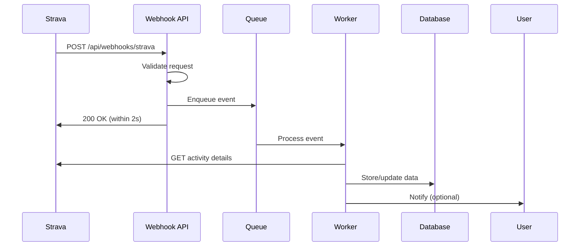

# Strava Webhook Sync Implementation Strategy

## Overview

This document outlines the implementation strategy for integrating Strava's webhook events API to automatically sync athlete activity data in real-time. This approach eliminates the need for polling and ensures data freshness while respecting API rate limits.

## Architecture Overview



## Implementation Components

### 1. Webhook Endpoint (`/api/webhooks/strava`)

**Purpose**: Receive and validate webhook events from Strava

**Key Features**:
- Responds within 2 seconds (Strava requirement)
- Validates webhook signature for security
- Enqueues events for async processing
- Handles both validation (GET) and event (POST) requests

**Implementation**:
```typescript
// app/api/webhooks/strava/route.ts
export async function GET(request: Request) {
  // Handle subscription validation
  const { searchParams } = new URL(request.url);
  const mode = searchParams.get('hub.mode');
  const challenge = searchParams.get('hub.challenge');
  const verifyToken = searchParams.get('hub.verify_token');
  
  if (mode === 'subscribe' && verifyToken === process.env.STRAVA_VERIFY_TOKEN) {
    return Response.json({ 'hub.challenge': challenge });
  }
  
  return new Response('Forbidden', { status: 403 });
}

export async function POST(request: Request) {
  // Receive webhook events
  const event = await request.json();
  
  // Quick validation
  if (!isValidWebhookEvent(event)) {
    return new Response('Bad Request', { status: 400 });
  }
  
  // Enqueue for async processing
  await enqueueWebhookEvent(event);
  
  // Must respond within 2 seconds
  return new Response('OK', { status: 200 });
}
```

### 2. Event Queue System

**Purpose**: Decouple webhook receipt from processing

**Options**:
1. **Vercel Queue** (if using Vercel hosting)
2. **Supabase Edge Functions** with pg_cron
3. **Redis Queue** (BullMQ)
4. **Database Queue** (simple implementation)

**Recommended**: Database Queue for simplicity

**Schema**:
```sql
CREATE TABLE webhook_events (
  id UUID PRIMARY KEY DEFAULT gen_random_uuid(),
  event_data JSONB NOT NULL,
  status VARCHAR(20) DEFAULT 'pending', -- pending, processing, completed, failed
  attempts INT DEFAULT 0,
  created_at TIMESTAMP WITH TIME ZONE DEFAULT NOW(),
  processed_at TIMESTAMP WITH TIME ZONE,
  error_message TEXT
);

CREATE INDEX idx_webhook_events_status ON webhook_events(status);
CREATE INDEX idx_webhook_events_created_at ON webhook_events(created_at);
```

### 3. Event Processor

**Purpose**: Process queued webhook events asynchronously

**Key Features**:
- Fetches detailed activity data from Strava API
- Handles rate limiting with exponential backoff
- Updates database with new/modified activities
- Manages token refresh if needed

**Processing Logic**:
```typescript
// lib/webhookProcessor.ts
async function processWebhookEvent(event: WebhookEvent) {
  const { object_type, object_id, aspect_type, owner_id, updates } = event;
  
  if (object_type === 'activity') {
    switch (aspect_type) {
      case 'create':
        await handleActivityCreate(object_id, owner_id);
        break;
      case 'update':
        await handleActivityUpdate(object_id, owner_id, updates);
        break;
      case 'delete':
        await handleActivityDelete(object_id, owner_id);
        break;
    }
  } else if (object_type === 'athlete' && aspect_type === 'update') {
    await handleAthleteDeauthorization(object_id, updates);
  }
}
```

### 4. Activity Sync Service

**Purpose**: Fetch and store activity details from Strava

**Key Features**:
- Token management and refresh
- Efficient data fetching strategy
- Stream data processing
- Error handling and retries

**Implementation**:
```typescript
// lib/stravaSync.ts
async function syncActivity(activityId: number, athleteId: number) {
  // 1. Get athlete's tokens
  const athlete = await getAthleteWithTokens(athleteId);
  
  // 2. Refresh token if needed
  if (isTokenExpired(athlete.strava_token_expires_at)) {
    await refreshStravaToken(athlete);
  }
  
  // 3. Fetch activity details
  const activity = await stravaAPI.getActivity(activityId, athlete.strava_access_token);
  
  // 4. Store basic activity data
  await upsertActivity(activity);
  
  // 5. Fetch and store streams (if activity is complete)
  if (activity.upload_id && !activity.manual) {
    const streams = await stravaAPI.getActivityStreams(
      activityId, 
      ['time', 'heartrate', 'latlng', 'altitude', 'cadence', 'watts'],
      athlete.strava_access_token
    );
    await storeActivityStreams(activityId, streams);
  }
  
  // 6. Update last_fetched_at
  await updateActivityFetchTime(activityId);
}
```

### 5. Initial Data Sync

**Purpose**: Fetch historical data when user first connects

**Strategy**:
```typescript
async function performInitialSync(athleteId: number) {
  const athlete = await getAthleteWithTokens(athleteId);
  
  // Fetch last 30 days of activities
  const thirtyDaysAgo = new Date();
  thirtyDaysAgo.setDate(thirtyDaysAgo.getDate() - 30);
  
  let page = 1;
  let hasMore = true;
  
  while (hasMore) {
    const activities = await stravaAPI.getAthleteActivities({
      after: Math.floor(thirtyDaysAgo.getTime() / 1000),
      per_page: 200,
      page: page
    }, athlete.strava_access_token);
    
    if (activities.length === 0) {
      hasMore = false;
    } else {
      // Process in batches
      for (const activity of activities) {
        await enqueueActivitySync(activity.id, athleteId, 'initial_sync');
      }
      page++;
    }
    
    // Respect rate limits
    await sleep(1000);
  }
}
```

### 6. Webhook Subscription Management

**Purpose**: Create and maintain webhook subscription

**Implementation**:
```typescript
// lib/webhookSubscription.ts
async function createWebhookSubscription() {
  const response = await fetch('https://www.strava.com/api/v3/push_subscriptions', {
    method: 'POST',
    headers: {
      'Content-Type': 'application/x-www-form-urlencoded',
    },
    body: new URLSearchParams({
      client_id: process.env.STRAVA_CLIENT_ID!,
      client_secret: process.env.STRAVA_CLIENT_SECRET!,
      callback_url: `${process.env.NEXT_PUBLIC_APP_URL}/api/webhooks/strava`,
      verify_token: process.env.STRAVA_VERIFY_TOKEN!,
    }),
  });
  
  if (!response.ok) {
    throw new Error('Failed to create webhook subscription');
  }
  
  const data = await response.json();
  return data.id;
}
```

## Database Schema Updates

### 1. Add sync tracking fields to existing tables

```sql
-- Add to strava_activities table
ALTER TABLE strava_activities 
ADD COLUMN sync_status VARCHAR(20) DEFAULT 'pending',
ADD COLUMN sync_attempts INT DEFAULT 0,
ADD COLUMN last_sync_error TEXT,
ADD COLUMN webhook_received_at TIMESTAMP WITH TIME ZONE;

-- Add to strava_athletes table
ALTER TABLE strava_athletes
ADD COLUMN initial_sync_completed BOOLEAN DEFAULT FALSE,
ADD COLUMN initial_sync_started_at TIMESTAMP WITH TIME ZONE,
ADD COLUMN webhook_subscription_active BOOLEAN DEFAULT TRUE;
```

### 2. Create webhook subscription tracking

```sql
CREATE TABLE webhook_subscriptions (
  id SERIAL PRIMARY KEY,
  subscription_id INT UNIQUE,
  callback_url VARCHAR(255),
  created_at TIMESTAMP WITH TIME ZONE DEFAULT NOW(),
  is_active BOOLEAN DEFAULT TRUE
);
```

## Implementation Phases

### Phase 1: Webhook Infrastructure (Week 1)
1. Create webhook endpoint
2. Implement event validation
3. Set up event queue table
4. Create basic event processor
5. Deploy and test webhook validation

### Phase 2: Activity Sync (Week 2)
1. Implement Strava API client with rate limiting
2. Create activity sync service
3. Implement token refresh logic
4. Add stream data processing
5. Test with sample activities

### Phase 3: Initial Sync & UI (Week 3)
1. Implement initial sync for new users
2. Add sync status to UI
3. Create manual sync button
4. Add activity sync progress indicators
5. Implement error handling and retry UI

### Phase 4: Monitoring & Optimization (Week 4)
1. Add webhook event monitoring
2. Implement sync analytics
3. Optimize database queries
4. Add sync health dashboard
5. Performance testing

## Security Considerations

1. **Webhook Validation**
   - Verify webhook source using verify_token
   - Implement request signature validation
   - Rate limit webhook endpoint

2. **Token Security**
   - Encrypt tokens at rest
   - Implement secure token refresh
   - Audit token usage

3. **Data Privacy**
   - Respect activity privacy settings
   - Handle scope limitations properly
   - Implement data retention policies

## Monitoring & Alerting

1. **Webhook Health**
   - Monitor webhook delivery success rate
   - Alert on repeated failures
   - Track response times

2. **Sync Performance**
   - Track sync queue depth
   - Monitor processing times
   - Alert on sync backlogs

3. **API Usage**
   - Track API rate limit usage
   - Monitor token refresh failures
   - Alert on API errors

## Error Handling Strategy

1. **Webhook Failures**
   - Implement exponential backoff
   - Max 3 retry attempts
   - Dead letter queue for failed events

2. **API Failures**
   - Retry with backoff for rate limits
   - Handle token expiration gracefully
   - Queue failed syncs for retry

3. **Data Conflicts**
   - Implement conflict resolution
   - Maintain audit trail
   - Allow manual resolution

## Testing Strategy

1. **Unit Tests**
   - Webhook validation logic
   - Event processing logic
   - API client methods

2. **Integration Tests**
   - End-to-end webhook flow
   - Activity sync process
   - Token refresh flow

3. **Load Tests**
   - Webhook endpoint performance
   - Queue processing throughput
   - Database query performance

## Environment Variables

Add to `.env.template`:
```
# Webhook Configuration
STRAVA_VERIFY_TOKEN=your-secure-verify-token
WEBHOOK_SECRET=your-webhook-secret

# Queue Configuration
QUEUE_BATCH_SIZE=10
QUEUE_POLL_INTERVAL=5000

# Sync Configuration
INITIAL_SYNC_DAYS=30
MAX_SYNC_RETRIES=3
SYNC_TIMEOUT_MS=30000
```

## Success Metrics

1. **Webhook Reliability**
   - 99.9% webhook delivery success
   - < 2s webhook response time
   - < 1% event loss rate

2. **Sync Performance**
   - < 5 min activity sync latency
   - > 95% sync success rate
   - < 1% data discrepancies

3. **User Experience**
   - Real-time activity updates
   - Clear sync status visibility
   - Graceful error handling

## Next Steps

1. Review and approve this implementation strategy
2. Set up development environment for webhooks
3. Create webhook endpoint and deploy to staging
4. Register webhook subscription with Strava
5. Begin Phase 1 implementation

## References

- [Strava Webhook Events API Documentation](https://developers.strava.com/docs/webhooks/)
- [Strava API Rate Limits](https://developers.strava.com/docs/rate-limits/)
- [NextJS API Routes](https://nextjs.org/docs/app/building-your-application/routing/route-handlers)
- [Supabase Edge Functions](https://supabase.com/docs/guides/functions)